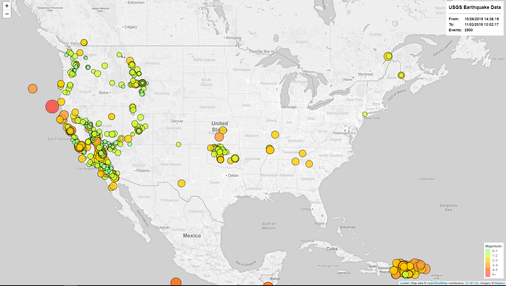
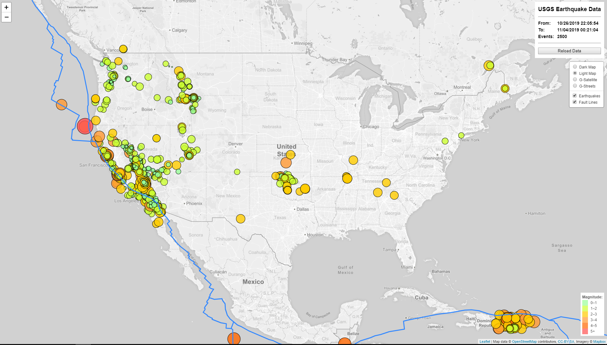
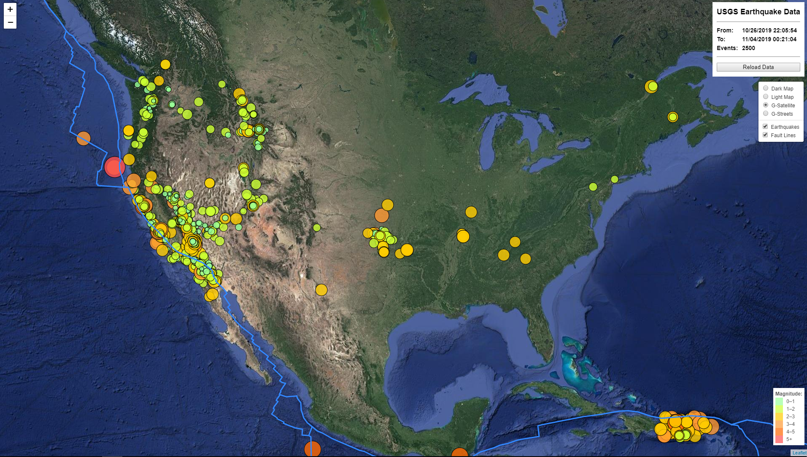

# leaflet-challenge - homework  17

## Comments to homework

### Functionality

Provided solution contains both Step1 and Step2.
Both steps have built in data pull from USGS web site with API call.
I have tested performance of leaflet with approximatelly 20k of inputs, Chrome choked on this data.
Therefore I put a limit on max number of event, it's set to 2500 but can be changed in the code, see 
````
const maxEvents = 2500;
````

Note (from USGS): The service limits queries to 20000, and any that exceed this limit will generate a HTTP response code “400 Bad Request

I have left the code to use local data, but this can be simply modified by setting following value to true:
````
// Set this value to true if you want to load new data from USGS when page is loaded.
// Leave it false to laod data stored with the solution.
const loadNewData = true;
````
Both steps show tooltips for earthquake events, event location and marks have requested features;
size and color is controlled by earthquake magnitude.
Both maps have lenged explaning color schema.

Both solution show number of displayed events, first and last event date. 

Step2 has 
* built in refresh function, by pressing button user can reload data at any time.
* provedes option for multiple maps, incl. Google maps
* earhquake marks and tectonic plates boundaries visibility can be independantly toggeled

## Files locations
Both Step1 and Step2 have their folders with identical structures:
* index.html file contains web page
* static/js/logic.js - program
* static/css/style.css - css 
* static/data/earthquakeData.js - USGS data
* static/data/PB2002_boundaries.js - Tectonic plates boundary (GeoJSON format)

## Step 1 Page


 

## Step 2 Page

### Light Map



### Satelite Map



